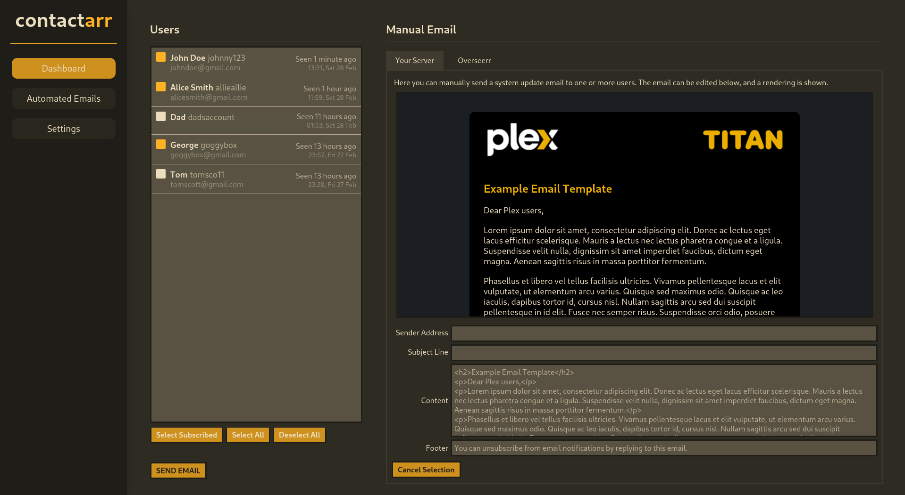

# Contactarr

> **WARNING**: This project is still under active development.

Contactarr is a user management and notification platform designed to make communicating with your Plex users easier. You can
draft manual emails to send to all of your users at once, but also allows you to set up automated email services that run
periodically.

It integrates directly with your existing media stack to gather user information.

## Features
- Uses [Tautulli](https://tautulli.com/) to import user data, including which shows each user has watched.
- Connects to [Overseerr](https://seerr.dev/) to import user requests, allowing you to send email updates on particular requests.
- Accepts SMTP credentials to easily send emails through an existing mail service.
- Supports multiple opt-out lists to allow users to opt out of different types of notifications.
- Uses [The TVDB](https://www.thetvdb.com/) to detect newly released seasons of shows.
- Supports an automated service to notify users about newly released seasons of shows they have previously watched. (Emails are sent every Sunday, notifying users of any new content released in the 7 days prior).
